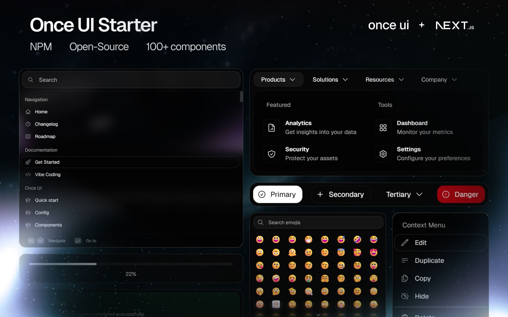
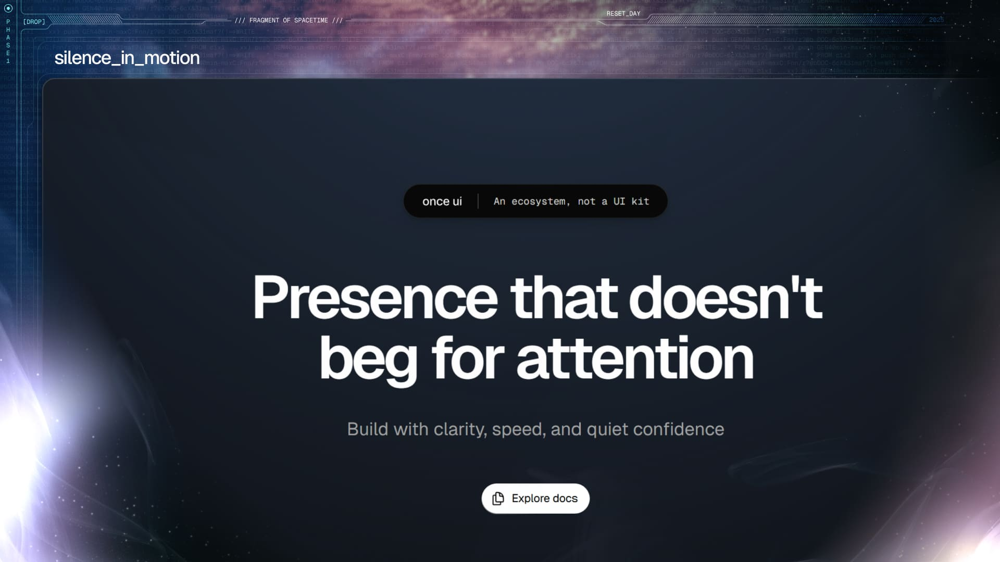

# Once UI for Next.js

A design system for indie builders who move fast and break limits without neglecting quality. Once UI combines the simplicity of low-code with the power of code: write 70% less compared to shadcn + tailwind.




## Features

Start building your Next.js app in minutes.

* **Customization**: Manage design config in a single file.
* **Components**: Access advanced components with simple APIs.
* **Data-viz**: Add responsive charts with a few lines of code.
* **SEO**: Use our SEO components to simplify meta and schema setup.
* **PRO**: Launch ready-made apps without minimal coding with Once UI Pro.

[Get Once UI Pro](https://once-ui.com/pricing)

## Demo

Check the [starter demo app](https://demo.once-ui.com).



## Documentation

Learn how to build with Once UI at [docs.once-ui.com](https://docs.once-ui.com/once-ui/quick-start).

## Quick start

[Magic Portfolio](https://once-ui.com/products/magic-portfolio): Our free portfolio starter used and loved by thousands of creatives. Simple, customizable, responsive.

[Magic Store](https://once-ui.com/products/magic-store) (PRO): Our premium ecommerce storefront that lets you launch your merch store in minutes. Payment, production and shipping managed by Fourthwall.

[Magic Docs](https://once-ui.com/products/magic-docs) (PRO): Our premium documentation generator. Just add your MDX files and let Magic Docs handle the rest.

[Magic Bio](https://once-ui.com/products/magic-bio) (PRO): Our premium link-in-bio template that automatically fetches open-graph data. Just add your links and deploy.

[Once UI Blocks](https://once-ui.com/blocks) (PRO): Copy-paste pre-designed blocks and deploy fully-functional sites with lightning speed.

[Once UI for Figma](https://once-ui.com/figma) (PRO): Design and prototype entire products from scratch in hours.

## Get started

Clone the starter template from GitHub:
```bash
git clone https://github.com/once-ui-system/nextjs-starter.git
```

Deploy to Vercel with a single click:
[](https://vercel.com/new/clone?repository-url=https%3A%2F%2Fgithub.com%2Fonce-ui-system%2Fnextjs-starter&redirect-url=https%3A%2F%2Fonce-ui.com%2F)

## Creators

Connect with us!

**Lorant One**: [Site](https://lorant.one) / [Threads](https://www.threads.net/@lorant.one) / [LinkedIn](https://www.linkedin.com/in/lorant-one/)

**Zsofia Komaromi**: [Site](https://zsofia.pro) / [Threads](https://www.threads.net/@zsofia_kom) / [LinkedIn](https://www.linkedin.com/in/zsofiakomaromi/)

## Become a Oncer


Join the [Design Engineers Club](https://discord.com/invite/5EyAQ4eNdS) on Discord to connect with us and share your projects.

Found a bug? Report it [here](https://github.com/once-ui-system/nextjs-starter/issues/new?labels=bug&template=bug_report.md). Got a feature request? Submit it [here](https://github.com/once-ui-system/nextjs-starter/issues/new?labels=feature%20request&template=feature_request.md).

## Sponsors

Once UI is an indie project. [Sponsor us](https://github.com/sponsors/once-ui-system) and get featured on our site!

## License

Distributed under the MIT License. See `LICENSE.txt` for more information.