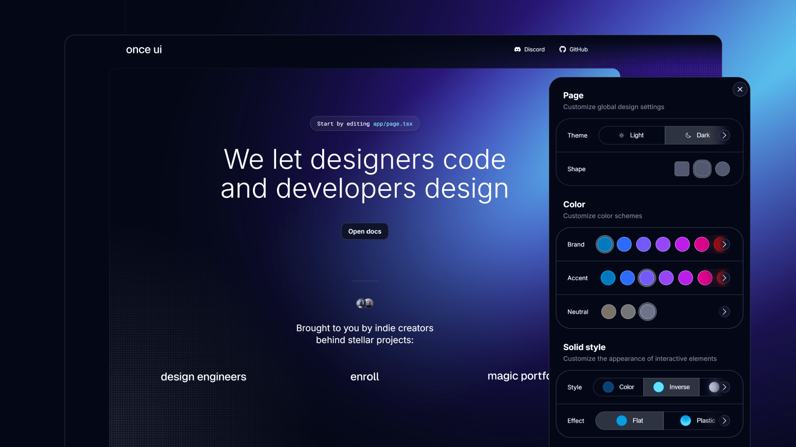

# Once UI for Next.js

A design system for indie builders who move fast and break limits without neglecting quality.


# Features

Start building your Next.js app in minutes with: 
* **A robust token and style system** that simplifies customization and ensures consistency. 
* **A copy-and-paste component library** that integrates seamlessly into your project.
* **Interactive documentation** to apply your branding and set component properties.

# Demo
[demo.once-ui.com](https://demo.once-ui.com)



# Getting started
Clone the starter template from GitHub.
```bash
git clone https://github.com/once-ui-system/nextjs-starter.git
```

You can also deploy it directly to Vercel.

[](https://vercel.com/new/clone?repository-url=https%3A%2F%2Fgithub.com%2Fonce-ui-system%2Fnextjs-starter&redirect-url=https%3A%2F%2Fonce-ui.com%2Fdocs%2F)


View the step-by-step guide at [once-ui.com/docs](https://once-ui.com/docs).

# Documentation
[once-ui.com/docs](https://once-ui.com/docs)

# Authors
Connect with us!

Lorant One: [Site](https://lorant.one), [Threads](https://www.threads.net/@lorant.one), [LinkedIn](https://www.linkedin.com/in/lorant-one/)  
Zsofia Komaromi: [Site](https://zsofia.pro), [Threads](https://www.threads.net/@zsofia_kom), [LinkedIn](https://www.linkedin.com/in/zsofiakomaromi/)

# Get involved
- Join the [Design Engineers Club](https://discord.com/invite/5EyAQ4eNdS) on Discord to connect with designers, developers and share your projects.
- Report a [bug](https://github.com/once-ui-system/nextjs-starter/issues/new?labels=bug&template=bug_report.md).
- Submit a [feature request](https://github.com/once-ui-system/nextjs-starter/issues/new?labels=feature%20request&template=feature_request.md).

# License

Distributed under the MIT License. See `LICENSE.txt` for more information.

# Sponsors

[github.com/sponsors/once-ui-system](https://github.com/sponsors/once-ui-system)

Become a sponsor and help us continue to develop and maintain this project.

# Once UI for Figma

Once UI is also available for Figma.  
Design and prototype entire products from scratch in hours. Use the same tokens and components as the Next.js design system.

Start designing: [once-ui.com/figma](https://once-ui.com/figma)

# Once UI Pro

Take your project further with Once UI Pro. Get access to complete templates, fully designed pages, and modular blocks that make building apps even faster.

Explore Pro: [once-ui.com/pro](https://once-ui.com/pro)