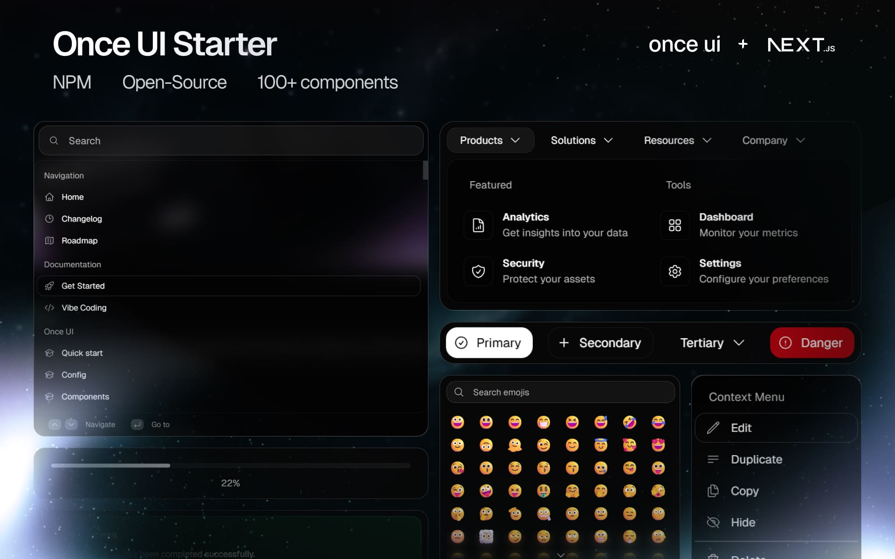

# Once UI for Next.js

A design system for indie builders, startups and freelancers. Once UI combines the simplicity of low-code with the power of code: write 70% less compared to shadcn + Tailwind. Includes 100+ advanced, open-source components.

Check the demo [here](https://demo.once-ui.com).



## Features

A lightweight starter template with the [Once UI Core](https://github.com/once-ui-system/core) package and our recommended setup.

* **Customization**: Manage design config in a single file.
* **Components**: Access advanced components with simple APIs.
* **Data-viz**: Add responsive charts with a few lines of code.
* **SEO**: Use our SEO components to simplify meta and schema setup.
* **PRO**: Launch ready-made apps with minimal coding with Once UI Pro.

## Documentation

Learn how to build with Once UI at [docs.once-ui.com](https://docs.once-ui.com/quick-start).

## Quick start

[Magic Portfolio](https://once-ui.com/products/magic-portfolio) (FREE): Portfolio starter used and loved by thousands of creatives. Simple, customizable, responsive.

[Magic Docs](https://once-ui.com/products/magic-docs) (FREE): Documentation generator. Just add your MDX files and let Magic Docs handle the rest.

[Stack](https://once-ui.com/stack) (PRO): A complete app built on Once UI: landing, dashboard, docs, store and more, composed from the surfaces you pick.

[Once UI Blocks](https://docs.once-ui.com/blocks/quickStart) (FREE): Copy-paste pre-designed blocks and deploy fully-functional sites with lightning speed.

[Get Once UI Pro](https://once-ui.com/pricing)

## Design

The design counterpart of the Once UI system is available [here](https://once-ui.com/figma).

## Get started

Clone the starter template from GitHub:
```bash
git clone https://github.com/once-ui-system/nextjs-starter.git
```

## Textify ads

Textify uses Google AdSense publisher `ca-pub-7461216674792341`, banner slot `4222442269` (728x90), and skyscraper slot `8002080184` (120x600). The banner slot appears twice around the preview; the skyscraper appears in the settings sidebar. These fixed-size placements load only at viewport widths of 1200px or more.

AdSense must approve the site and domain before ads can serve. Development on localhost may show an empty placement; verify delivery on the approved production domain and ensure any required consent configuration is in place.

## Creators

Connect with us!

**Lorant One**: [Site](https://lorant.one)

**Design Engineers Club**: [Site](https://designengineers.club)

## Contribute

Please use the Once UI Core [GitHub repository](https://github.com/once-ui-system/core) for design system contributions.

## Sponsors

Once UI is an indie project. [Sponsor us](https://github.com/sponsors/once-ui-system) and get featured on our site!

## License

Distributed under the MIT License. See `LICENSE.txt` for more information.

## Deploy to Vercel
[](https://vercel.com/new/clone?repository-url=https%3A%2F%2Fgithub.com%2Fonce-ui-system%2Fnextjs-starter&project-name=nextjs-starter&repository-name=nextjs-starter&redirect-url=https%3A%2F%2Fgithub.com%2Fonce-ui-system%2Fnextjs-starter&demo-title=Next.js%20Starter&demo-description=Showcase%20your%20designers%20or%20developer%20portfolio&demo-url=https%3A%2F%2Fdemo.nextjs-starter.com&demo-image=%2F%2Fraw.githubusercontent.com%2Fonce-ui-system%2Fnextjs-starter%2Fmain%2Fpublic%2Fimages%2Fog%2Fhome.jpg)